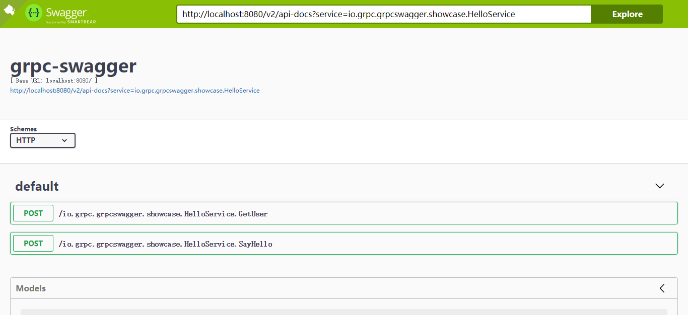
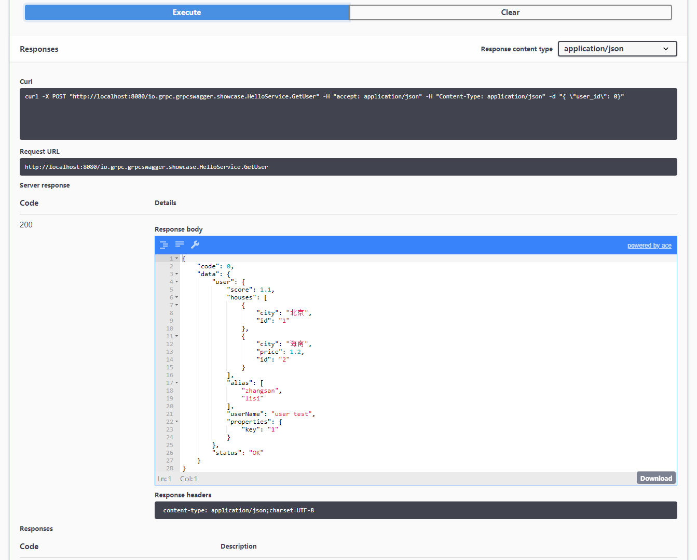
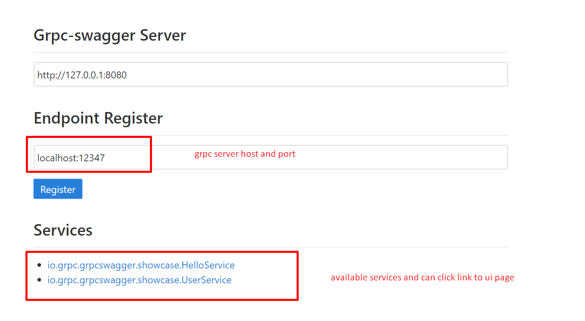

# gRPC-swagger

[](https://travis-ci.com/grpc-swagger/grpc-swagger)
[](https://codecov.io/gh/grpc-swagger/grpc-swagger)
[](https://github.com/Naereen/StrapDown.js/blob/master/LICENSE)

[中文文档](README_CN.md)

<!-- toc -->

- [What is gRPC-swagger](#what-is-grpc-swagger)
- [Feature List](#feature-list)
- [Screenshots](#screenshots)
- [Live Demo](#live-demo)
- [Build and Run](#build-and-run)
  * [Use released jar](#use-released-jar)
  * [Build from source](#build-from-source)
  * [Other parameters](#other-parameters)
- [How to use it](#how-to-use-it)
- [API](#api)
  * [Register Endpoint](#register-endpoint)
  * [Services List](#services-list)
  * [Call gRPC Method](#call-grpc-method)
  * [Swagger API](#swagger-api)
- [Acknowledgment](#acknowledgment)
- [Contribute](#contribute)
- [FAQ](#faq)
- [License](#license)

<!-- tocstop -->

## What is gRPC-swagger

gRPC-swagger is a [gRPC](https://github.com/grpc/) debuggling tool developed based on [gRPC reflection](https://github.com/grpc/grpc/blob/master/doc/server-reflection.md). It can be used to list and call gRPC methods using [swagger-ui](https://github.com/swagger-api/swagger-ui) conveniently. As gRPC-swagger is based on gRPC reflection, you only need to enable reflection feature when starting the service and no need modifying proto files and related code implementations. 

## Feature List

* Easy to use, just need enable reflection when starting the service, without modifying protos and related implementations.
* Integrated with swagger-ui, you can see the definitions of gRPC methods and parameters conveniently.
* Simple to call gRPC method.

## Screenshots






## Live Demo

[demo](http://ui.grpcs.top)

## Build and Run
### Use released jar
```base
wget https://github.com/grpc-swagger/grpc-swagger/releases/latest/download/grpc-swagger.jar 
java -jar grpc-swagger.jar
```
### Build from source
```bash
mvn clean package
java -jar grpc-swagger-web/target/grpc-swagger.jar
```

By default it will start at port 8080, use `--server.port=yourport` if
you want to use another port.
```bash
java -jar grpc-swagger-web/target/grpc-swagger.jar --server.port=8888
```

### Other parameters
- `--enable.list.service=(true/false)` - Weather enable list registered services through listServices api. 
- `--service.expired.seconds=expiredSeconds` - If `expiredSeconds` is greater than 0, the registered service will be expired after `expiredSeconds` if no access.

## How to use it
1. Run gRPC-swagger, referring to [Build and Run](#build-and-run) 
2. Enable reflection when staring service. Below is a java example:  
   add dependency to `pom.xml`:
   ```xml
   <dependency>
       <groupId>io.grpc</groupId>
       <artifactId>grpc-services</artifactId>
       <version>${grpc.version}</version>
   </dependency>
   ```
   enable reflection:
   ```java
   Server server = ServerBuilder.forPort(SERVER_PORT)
       .addService(new HelloServiceImpl())
       .addService(ProtoReflectionService.newInstance())
       .build()
       .start();
   ``` 
3. Register endpoint. Open [this page](http://ui.grpcs.top/r.html), input necessary message and click register button, gRPC-swagger will automatically scan available services and return successful registered services when finished. You can click service link jump to ui page.


 
4. Use swagger-ui to see gRPC services.
5. Click `Try it out` button to have a test on the gRPC method.

### Parameters
- Request：the request data of gRPC，JSON format.
- headers：metadata（header）passing to gRPC server，JSON format. Key represent header name，value represent header value.

## API
### Register Endpoint

url：`/register`

parameters：
* `host` - required, e.g. `localhost`
* `port` - required, e.g. `12347`

return example:
```json 
{
    "code": 1,
    "data": [
        {
            "service": "io.grpc.grpcswagger.showcase.HelloService",
            "endPoint": "localhost:12347"
        }
    ]
}
```

### Services List
url: `/listServices`

return example:
```json 
{
    "code": 1,
    "data": [
        {
            "service": "io.grpc.grpcswagger.showcase.HelloService",
            "endPoint": "localhost:12347"
        }
    ]
}
```

### Call gRPC Method 
url: `/{rawFullMethodName}`

parameters：
* `rawFullMethodName` - the full gRPC method name，e.g. `io.grpc.grpcswagger.showcase.HelloService.GetUser`
* `payload` - gRPC method parameters，JSON format。 You can use `endpoint` parameter to specify the calling endpoint.

### Swagger API
url： `/v2/api-docs`

return data used by swagger-ui

parameters：
* service - full service name，e.g. `io.grpc.grpcswagger.showcase.HelloService`.

## Acknowledgment
Thanks to the [polyglot](https://github.com/grpc-ecosystem/polyglot) project，The reflection related logic in our project is modified on polygolt.

## Contribute
Feel free to open an issue or pull request. We will appreciate it!

## FAQ

## License
[MIT License.](/LICENSE)
