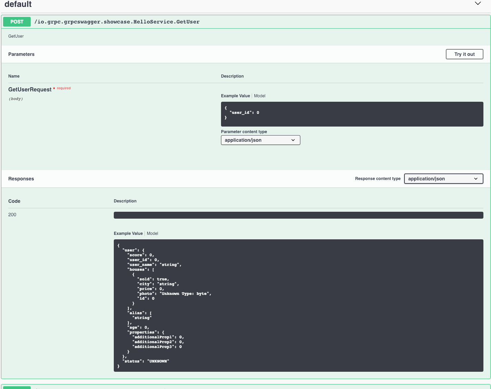
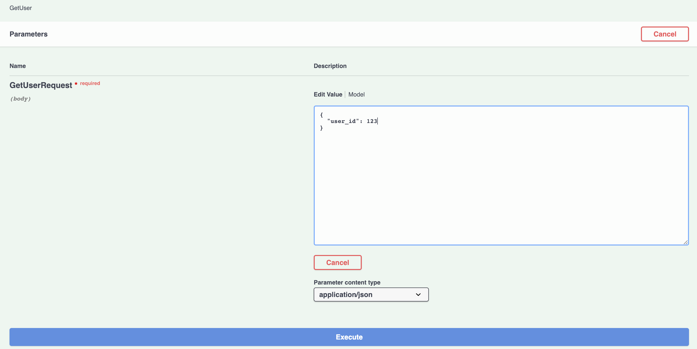
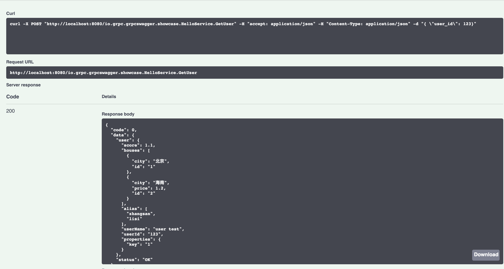

# gRPC-swagger

[](https://travis-ci.com/grpc-swagger/grpc-swagger)
[](https://codecov.io/gh/grpc-swagger/grpc-swagger)
[](https://github.com/Naereen/StrapDown.js/blob/master/LICENSE)

# What is grpc-swagger
Just as its name implies, grpc-swagger is the [swagger](https://swagger.io/) for [grpc](http://grpc.io/)



# Feature List

# Live Demo

[demo](http://52.231.167.148/index.html)

# How to use it

# Run with Docker
```
mvn clean package
docker build -t grpc-swagger .
docker run -p 8080:8080 grpc-swagger
```

# Contribute
Feel free to open an issue or pull request. We will appreciate it!
[sonar](https://sonarcloud.io/dashboard?id=io.grpc%3Agrpc-swagger)

# FAQ

# License
[MIT License.](/LICENSE)